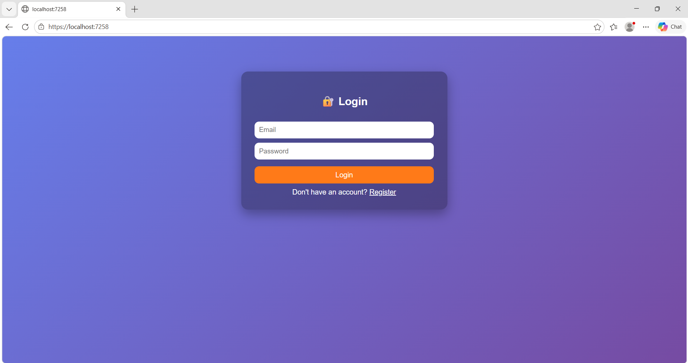
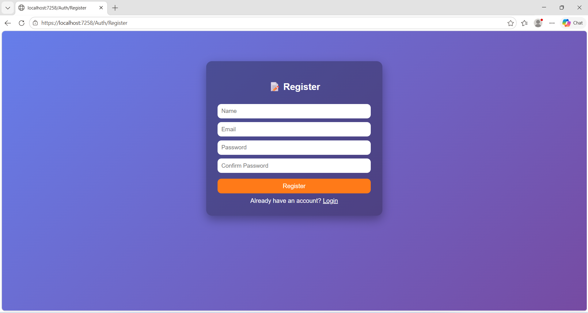
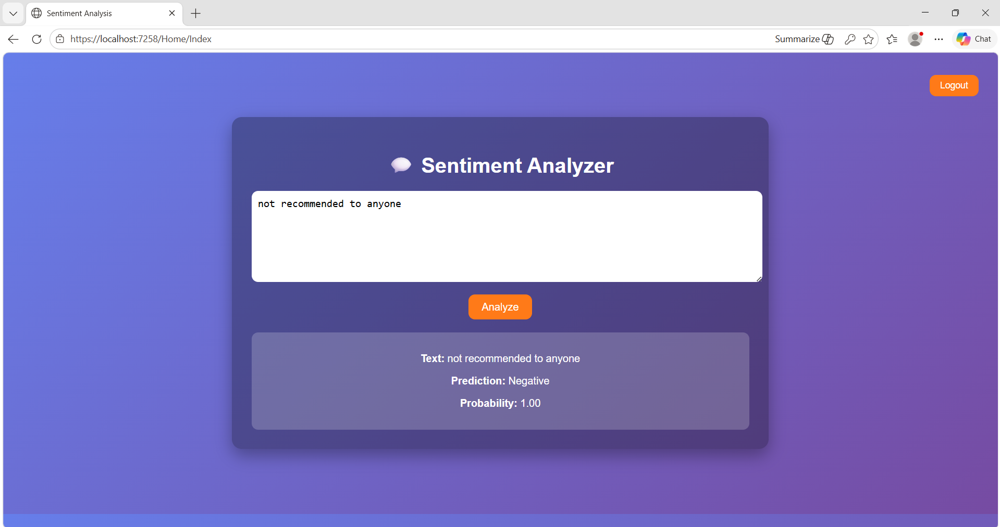

# 💬 Text Classification (Sentiment Analysis) - ASP.NET Core

## 🚀 Overview

This project is a **Text Classification (Sentiment Analysis) Web Application** built using modern technologies like **ASP.NET Core, ML.NET, SQL Server, and JWT Authentication**.

The system analyzes user input text and predicts whether the sentiment is:

* ✅ Positive
* ❌ Negative

---

## 🎯 Key Features

✔ User Registration & Login (JWT Authentication)
✔ Secure Password Hashing (ASP.NET Identity)
✔ Prevent Duplicate Users (Email & Username)
✔ AI-based Sentiment Prediction
✔ Model Accuracy Display
✔ Logging (User actions & errors)
✔ Logout functionality
✔ Clean and Responsive UI

---

## 🧠 Machine Learning Workflow

```
User Input Text
      ↓
FeaturizeText()
      ↓
SDCA Machine Learning Model
      ↓
Prediction (Positive / Negative)
      ↓
Probability + Accuracy
```

---

## 🔐 Authentication Flow

```
Register User → Store in SQL Server
        ↓
Login → Generate JWT Token
        ↓
Store Token (LocalStorage)
        ↓
Use Token in API Requests
        ↓
Logout → Remove Token
```

---

## 📸 Screenshots

### 🔐 Login Page



---

### 📝 Register Page



---

### 📊 Dashboard (Prediction Page)



---

## ⚙️ Tech Stack

* ASP.NET Core MVC + Web API
* ML.NET (Machine Learning)
* SQL Server
* Entity Framework Core
* JWT Authentication
* JavaScript (Fetch API)
* HTML, CSS

---

## 🗄️ Database

User data is stored securely with:

* Hashed Passwords
* Unique Email & Username
* Audit Fields:

  * CreatedBy
  * CreatedDate
  * UpdatedBy
  * UpdatedDate
  * IsDeleted

---

## 🔒 Security Features

✔ Password Hashing (No plain text storage)
✔ JWT Authentication
✔ API Authorization
✔ Input Validation
✔ Secure Token Handling

---

## 📊 Sample Output

```
Text: This product is amazing!
Prediction: Positive
Probability: 0.92
Accuracy: 85%
```

---

## 🧾 Logging

Application logs include:

* User Registration attempts
* Login Success/Failure
* Prediction requests
* Error handling

Logs help in debugging and monitoring system behavior.

---

## 🚀 How to Run the Project

1. Clone the repository

2. Open project in Visual Studio

3. Update `appsettings.json`:

   * Add SQL Server connection string
   * Add JWT Secret Key (minimum 32 characters)

4. Run database migrations:

```
dotnet ef database update
```

5. Run the project:

```
dotnet run
```

6. Open in browser:

```
https://localhost:xxxx/Auth/Login
```

---

## 🎯 Future Enhancements

* 🔥 Add Neutral Sentiment (3-class classification)
* 📊 Prediction History per User
* 👤 User Profile Page
* 📈 Analytics Dashboard
* 🌐 Cloud Deployment (Azure/AWS)

---

## 👩‍💻 Author

**Mishika Sureliya**

---

## ⭐ Conclusion

This project demonstrates a complete **end-to-end AI-powered web application** integrating:

* Machine Learning
* Authentication & Security
* Database Management
* Interactive User Interface

It showcases how AI can be practically implemented in real-world web applications.

---
